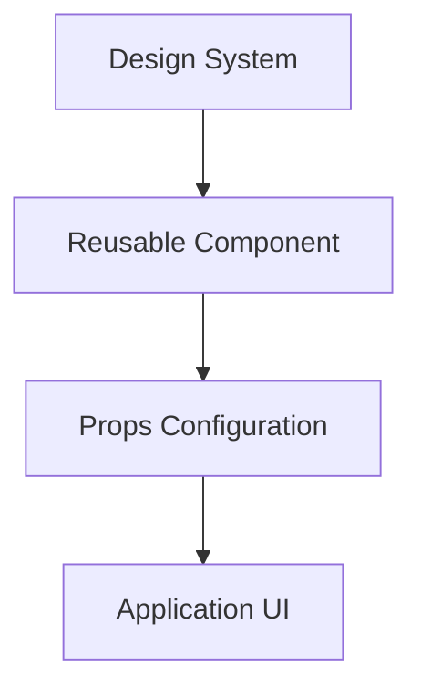

# Component Library

## Overview

This Component Library is a reusable collection of UI components designed to build consistent, scalable, and maintainable user interfaces. It helps developers speed up development by reusing well-structured, customizable components across multiple projects.

The library follows modern frontend best practices and focuses on **reusability, accessibility, and consistency**.

---

## Features

* Reusable and modular UI components
* Consistent design system
* Customizable via props
* Responsive and accessible components
* Easy integration into existing projects
* Scalable architecture

---

## Tech Stack

* **Framework**: React / Next.js
* **Language**: TypeScript / JavaScript
* **Styling**: CSS / Tailwind CSS / Styled Components
* **Build Tool**: Vite / Webpack
* **Package Manager**: npm / yarn / pnpm

---

## Folder Structure

```
component-library/
├── src/
│   ├── components/
│   │   ├── Button/
│   │   │   ├── Button.tsx
│   │   │   └── index.ts
│   │   ├── Card/
│   │   └── Input/
│   ├── styles/
│   ├── index.ts
│   └── utils/
├── package.json
├── tsconfig.json
└── README.md
```

---

## Installation

### Using npm

```bash
npm install your-component-library
```

### Using yarn

```bash
yarn add your-component-library
```

---

## Usage

### Importing Components

```tsx
import { Button, Card } from "your-component-library"
```

### Example

```tsx
<Button variant="primary" size="md">
  Click Me
</Button>
```

---

## Component Workflow Diagram



---

## Customization

Components can be customized using:

* Props (size, variant, state)
* Theme configuration
* Utility classes

Example:

```tsx
<Button variant="outline" disabled />
```

---

## Accessibility

* Semantic HTML elements
* Keyboard navigation support
* ARIA attributes where required
* Focus and hover states

---

## Testing

* Unit testing using Jest / Vitest
* Component testing with React Testing Library

Run tests:

```bash
npm test
```

---

## Versioning

This library follows **Semantic Versioning (SemVer)**:

* `MAJOR` – Breaking changes
* `MINOR` – New features
* `PATCH` – Bug fixes

---

## Contribution Guidelines

1. Fork the repository
2. Create a new branch
3. Add or update components
4. Ensure tests pass
5. Submit a pull request

---

## Roadmap

* Add more base components
* Improve theme customization
* Add dark mode support
* Publish Storybook documentation

---

## License

MIT License

---

## Author

Developed by **Komal Kumawat**
